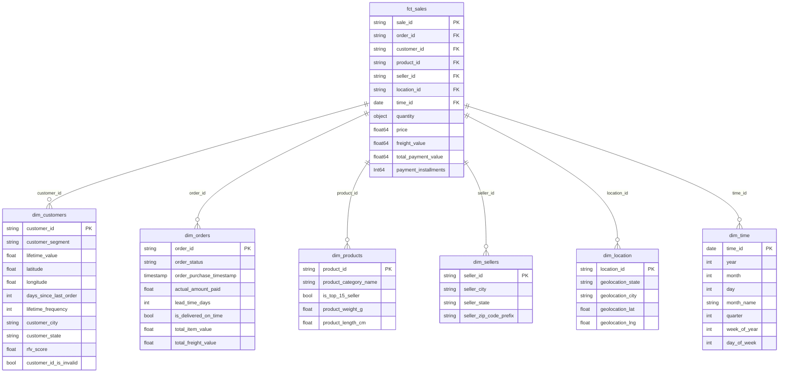
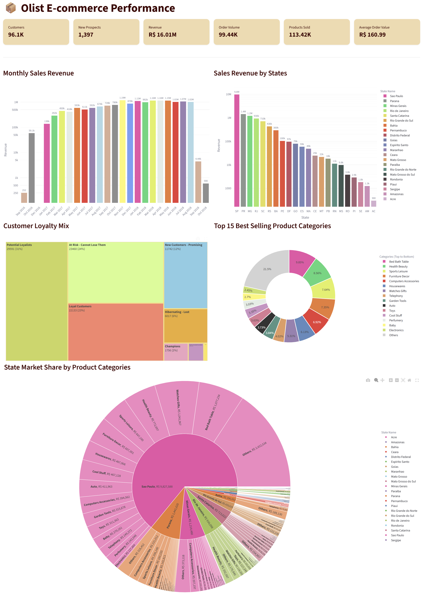
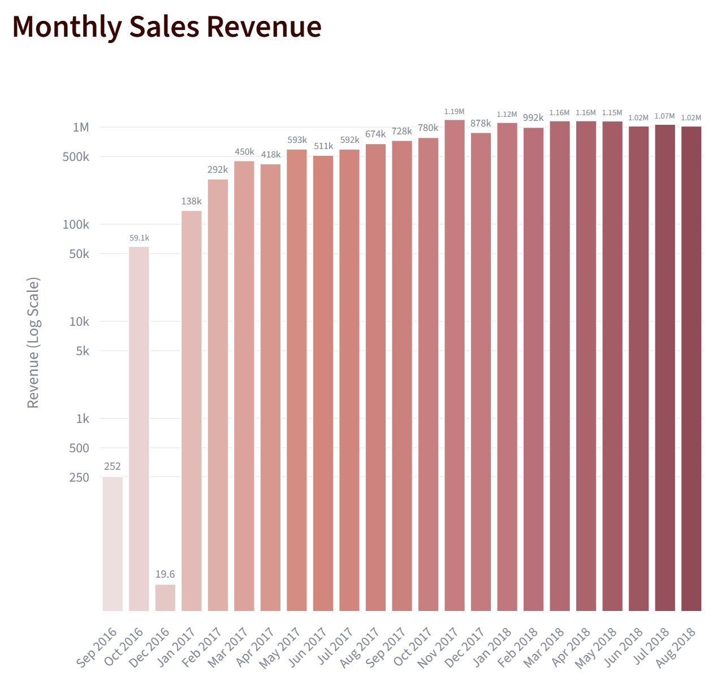
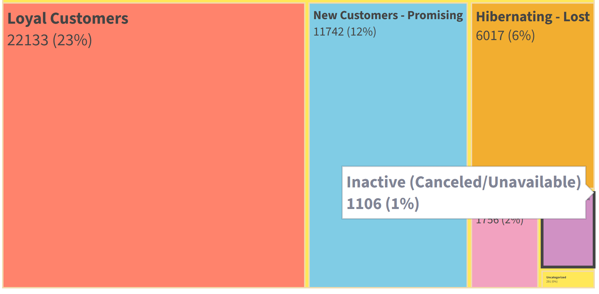
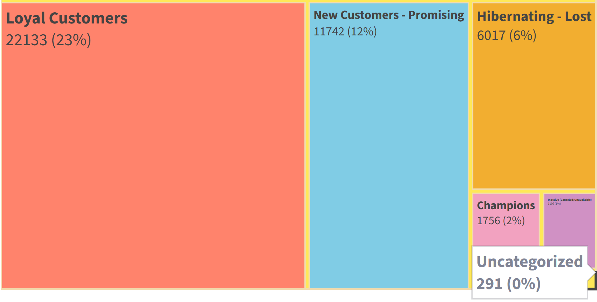
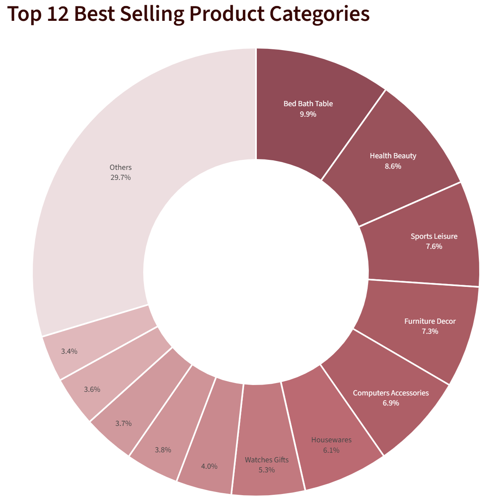

# 📦 Olist E-commerce Data Pipeline

> An end-to-end production data pipeline built on the Brazilian Olist e-commerce dataset — orchestrating extraction, transformation, and visualization across a modern lakehouse stack.

[](https://python.org)
[](https://getdbt.com)
[](https://dagster.io)
[](https://cloud.google.com/bigquery)
[](https://streamlit.io)

---

## 🗺️ Pipeline Overview

<p align="center">
  <br>
  <b>Figure 1</b>
</p>

As shown in figure 1, raw CSV files from Olist are extracted and loaded by **Meltano** and orchestrated end-to-end by **Dagster** (with full asset lineage). Data is transformed through three dbt layers, staging, intermediate and mart, coupled with **dbt-expection** for rigorous testing within a modern **Medallion Architecture**.This process turns raw data into analytics-ready insights in **BigQuery**, which are then surfaced via a **Streamlit** executive dashboard.

---

## 🧩 Core Components

| Component | Tool | Role |
|---|---|---|
| **meltano/** | [Meltano](https://meltano.com) | Data Extraction & Loading (EL) — ingests raw Olist CSV datasets into BigQuery via configured tap/target plugins |
| **dagster/** | [Dagster](https://dagster.io) | Orchestration & Workflow Management — defines asset lineage, schedules, quality gates, and auto-generates dbt docs |
| **dbt_olist/models/staging/** | dbt | Raw source models as views — light renaming, type casting, and deduplication of source tables |
| **dbt_olist/models/intermediate/** | dbt | Business logic layer — RFV segmentation, order enrichment, customer metrics, product categorization |
| **dbt_olist/models/marts/core/** | dbt | Fact & Dimension tables for Olist sales — `fct_sales`, `dim_customers`, `dim_orders`, `dim_products`, `dim_sellers`, `dim_location`, `dim_time` |
| **eda/eda.ipynb** | Jupyter + Pandas | Exploratory data analysis — statistical profiling, null checks, geographic normalization audits, and data cleaning validation |
| **salesportal.py / .streamlit/** | [Streamlit](https://streamlit.io) + Plotly | Executive dashboard — KPIs, monthly revenue trends, state-level sales, RFM segmentation, and product category analysis |

---
## ⚙️ Setup & Installation

Follow these steps to replicate the environment and run the full data pipeline.

### Step 1: Download the Olist Dataset

1. Download the dataset from Kaggle: [Brazilian E-Commerce Public Dataset by Olist](https://www.kaggle.com/datasets/olistbr/brazilian-ecommerce)

2. Place the CSV files into the `data/` folder so the structure looks like this:
```
2026-02-06_DS4_GP5_olist/
├── data/                                   ← you must create this manually
│   ├── olist_customers_dataset.csv
│   ├── olist_orders_dataset.csv
│   ├── olist_order_items_dataset.csv
│   ├── olist_order_payments_dataset.csv
│   ├── olist_order_reviews_dataset.csv
│   ├── olist_products_dataset.csv
│   ├── olist_sellers_dataset.csv
│   ├── olist_geolocation_dataset.csv
│   └── product_category_name_translation.csv
└── dbt_olist/
    └── seeds/
        └── patch_missing_geolocations.csv  ← already included in the repo, do not download
```

> **Note:** The `data/` folder is git-ignored and must be populated manually. The `seeds/` folder is already committed and requires no action.


### Step 2: Environment & Secrets Setup

First, recreate the environment and provide your own credentials.

1. **Clone & Enter Repo:** Downloads the project from GitHub and navigates into it.
```bash
   git clone https://github.com/<your-org>/2026-02-06_DS4_GP5_olist.git
   cd 2026-02-06_DS4_GP5_olist
```

2. **Create/Update Conda Environment:** Installs all required Python packages and activates the project environment.
```bash
   conda env update --file environment.yml --prune
   conda activate olist-bq
```

3. **Setup Credentials:**
   - Rename `.env.example` to `.env` — makes the template file your personal config file:
```bash
     mv .env.example .env
```
   - Open `.env` and fill in your `GOOGLE_PROJECT_ID`:
```dotenv
     GOOGLE_PROJECT_ID=your-project-id-here
```
   - **GCP Auth:** Tells Google Cloud to use your local account for all API access:
```bash
     gcloud auth application-default login
```

4. **dbt Profile:** Copies the dbt connection config to the default location where dbt looks for it on your machine.
```bash
   mkdir -p ~/.dbt
   cp dbt_olist/profiles.yml ~/.dbt/profiles.yml
```

### Step 3: Meltano Ingestion

Meltano will auto-install the plugins on the first run as long as you are in the `olist-bq` environment.
```bash
# Loads your .env credentials into the terminal session
export $(cat .env | grep -v '#' | xargs)
# Reads the CSV files and uploads them to BigQuery
meltano --cwd meltano run tap-csv target-bigquery
```

### Step 4: dbt Initialization

dbt needs to download packages and build `manifest.json` before Dagster can load the asset graph. **This step is required — Dagster will crash on startup without `manifest.json`.**
```bash
cd dbt_olist
dbt deps                                        # Downloads dbt packages listed in packages.yml
dbt seed --select patch_missing_geolocations    # Loads fallback zip codes into BigQuery (required by models)
dbt parse --no-partial-parse                    # Generates manifest.json — Dagster cannot start without this
dbt build                                       # Runs and tests all models, creating tables in BigQuery
dbt docs generate                               # Generates browsable documentation
cd ..
```
Seed is optional: only needed if geolocation data has missing entries.
> **If `dbt build` fails on first run:** Run `dbt parse --no-partial-parse` alone first, then retry `dbt build`. The manifest must exist before any other dbt command can compile the full graph.

### Step 5: Dagster Orchestration

> **Prerequisite:** `manifest.json` must already exist inside `dbt_olist/target/` from Step 4. If it's missing, Dagster will fail to start with a `FileNotFoundError`.
```bash
export DAGSTER_DBT_PARSE_PROJECT_ON_LOAD=1
export $(cat .env | grep -v '#' | xargs)
dagster dev -f dagster/definition.py
```

**If you see assets being skipped** (e.g. `quality_gate` skipped due to `patch_missing_geolocations`), it means the seed was not materialized through Dagster. Fix it by either:

- **Option A (UI):** Open `http://localhost:3000` → Assets → search `patch_missing_geolocations` → click **Materialize**, then re-run `run_full_pipeline`
- **Option B (CLI, before launching Dagster):**
```bash
cd dbt_olist && dbt seed --select patch_missing_geolocations && cd ..
```
Then relaunch Dagster.

### Step 6: Final Analytics

Once the data is in BigQuery and the models are built, run the final outputs:

1. **EDA:** Open `notebooks/eda.ipynb` in VS Code, then set the kernel:
   - Click **Select Kernel** (top right of the notebook)
   - Choose **Python Environments...**
   - Select **olist-bq** from the list

   > **Note:** Do not select "Existing Jupyter Server" or "Colab" — the notebook requires the local `olist-bq` conda environment which has all project dependencies installed.

   Once the kernel is set, run all cells.

2. **Sales Portal:** Launches the Streamlit dashboard in your browser. 
    ```bash
    streamlit run salesportal.py
    ```
    > **Note:** The salesportal.py is in the root directory.
---

## 📁 Project Structure

```
2026-02-06_DS4_GP5_olist/
├── dagster/
│   ├── assets/
│   └── definition.py               # Dagster asset definitions & pipeline orchestration
├── data/
│   ├── olist_customers_dataset.csv
│   ├── olist_orders_dataset.csv
│   ├── olist_order_items_dataset.csv
│   ├── olist_order_payments_dataset.csv
│   ├── olist_order_reviews_dataset.csv
│   ├── olist_products_dataset.csv
│   ├── olist_sellers_dataset.csv
│   ├── olist_geolocation_dataset.csv
│   └── product_category_name_translation.csv
├── dbt_olist/
│   ├── models/
│   │   ├── staging/                # Source views
│   │   ├── intermediate/           # Business logic tables
│   │   └── marts/core/             # Fact & dimension tables
│   ├── seeds/
│   │   └── patch_missing_geolocations.csv
│   └── dbt_project.yml
├── eda/
│   └── eda.ipynb                   # EDA, data profiling & cleaning notebook
├── meltano/
│   ├── plugins/
│   └── meltano.yml
├── .env.example
├── environment.yml
├── check_env.py
└── salesportal.py                  # Streamlit executive dashboard
```
---

## 🗄️ Data Model — Star Schema (ERD)

---

## ⚙️ Dagster Asset Lineage

The pipeline is defined in `dagster/definition.py` and consists of three asset groups executed in sequence:

### Asset Groups

| Asset | Group | Depends On | Description |
|---|---|---|---|
| `olist_dbt_assets` | *(default)* | Meltano EL | Runs all dbt models via `dbt run`, excluding `dbt_expectations` package tests from the run step |
| `quality_gate` | `quality` | `olist_dbt_assets` | Executes `dbt test --select package:dbt_expectations` — acts as a quality checkpoint before docs generation |
| `dbt_docs_asset` | `metadata` | `quality_gate` | Runs `dbt docs generate` to refresh the dbt documentation site after all tests pass |

### Execution Flow
```
olist_dbt_assets  ──▶  quality_gate  ──▶  dbt_docs_asset
  (dbt run)            (dbt test)        (dbt docs generate)
```

### Custom Translator (`CustomTranslator`)

A custom `DagsterDbtTranslator` subclass enriches the Dagster asset graph UI with column-level metadata:

- Reads `catalog.json` from `dbt_olist/target/` at startup to retrieve **actual BigQuery column types**
- Priority order for column type resolution: **Catalog** (`catalog.json`) → **YAML definition** (`data_type`) → `"unknown"` fallback
- Injects `dagster/column_schema` metadata so column names, types, and descriptions appear directly in the **Dagster asset lineage UI**

### Registered Job

| Job | Selection | Trigger |
|---|---|---|
| `run_full_pipeline` | `AssetSelection.all()` | Manual (Dagster UI) or scheduled |

### Key Implementation Notes

- `ROOT_DIR` is resolved via `Path(__file__).resolve().parents[1]` — navigates up from `dagster/definition.py` to the project root, ensuring all relative paths resolve correctly regardless of where Dagster is launched from
- `.env` is loaded at startup via a custom `_load_dotenv()` function that handles UTF-8 BOM encoding (`utf-8-sig`) and strips quotes from values
- `dbt run` explicitly **excludes** `dbt_expectations` package models; `dbt test` explicitly **selects** only `dbt_expectations` tests — separating transformation from validation in the asset stream
---
## 🔬 Exploratory Data Analysis (EDA)

The EDA notebook (`notebooks/eda.ipynb`) performs a full data quality audit, consistency check, and business analysis against the transformed BigQuery marts before dashboard consumption.

### Notebook Sections

| # | Section | Key Output |
|---|---|---|
| 1 | **Environment Setup & BigQuery Configuration** | Connected to BigQuery via `GOOGLE_PROJECT_ID` from `.env` using the Python SDK |
| 2 | **Data Loading & Initial Shape Analysis** | Loaded 6 core tables; `fct_sales` confirmed at **113,419 rows × 12 columns** |
| 3 | **Statistical Profiling & Distribution Curves** | Mean order value R$141 vs. median R$92 — long-tail distribution confirmed; max single order R$6,929 |
| 4 | **Dim_Customers Logic Check & Order Status Filtering** | NULL RFV: **0** — full customer base scored; `customer_id_is_invalid` uniformly `False` |
| 5 | **Dim_Products & Categorization Audit** | **591 uncategorized products** flagged; zero null physical dimensions (`weight`, `length`) |
| 6 | **Intermediate Table Patching & Monetary Logic** | Null monetary values patched to 0; long decimals rounded to 2dp (e.g. `238.99000000000004` → `238.99`) |
| 7 | **City & State Normalization Check** | **10 cities** with residual accent encoding errors (`maceia³` → `maceió`); 0 affected states |
| 8 | **Final Sales & Payments Integrity** | **0 rows dropped** from `fct_sales` — no zero-payment or missing payment method records found |
| 9 | **Revenue & Order Trends + Dec 2016 Anomaly** | Nov 2016 = 0 entries, Dec 2016 = 1 entry only — confirmed upstream data gap in Kaggle source, not a business event |
| 10 | **Top Product Categories by Order Volume** | `bed_bath_table` leads with highest order count; `computers` leads by AOV despite lower volume |
| 11 | **Average Order Value (AOV) by Category & Payment Method** | Credit card dominates at ~74% of payments; computers category has highest AOV |
| 12 | **Repeat Purchase Rate & Revenue Contribution** | Only ~3% of customers make repeat purchases, contributing ~6% of total revenue |
| 13 | **Review Score → Revenue & AOV Impact** | Score 5 generates highest orders and revenue; low scores correlate with higher AOV (expensive items rated poorly) |
| 14 | **Order Cancellation Rate** | Cancellation rate <1% — strong platform reliability despite low repeat purchase rate |
| 15 | **Review Score vs Shipping Days** | Confirmed negative correlation — faster delivery directly drives higher review scores |
| 16 | **Top 15 Best Selling Categories** | Donut + bar chart mirroring dashboard — `bed_bath_table` dominates by volume |
| 17 | **State Market Share by Product Category** | Sunburst + heatmap — São Paulo dominates all categories; secondary focus on MG and RJ |
| 18 | **Customer Loyalty Segmentation** | RFV treemap + revenue by segment — Potential Loyalists largest group; Champions small but highest value |

---

### 📊 Statistical Profile — `fct_sales`

| Metric | `price` | `freight_value` | `total_payment_value` |
|---|---|---|---|
| **Count** | 113,419 | 113,419 | 113,419 |
| **Mean** | R$ 121.27 | R$ 19.85 | R$ 141.15 |
| **Median (50%)** | R$ 75.00 | R$ 16.22 | R$ 92.65 |
| **Std Dev** | R$ 185.56 | R$ 15.84 | R$ 191.92 |
| **Min** | R$ 0.85 | R$ 0.00 | R$ 9.34 |
| **Max** | R$ 6,735.00 | R$ 409.68 | R$ 6,929.31 |

> **Key insight:** Mean (R$141) significantly exceeds median (R$92), indicating a right-skewed distribution driven by high-value outlier orders — log-scale applied in the dashboard to preserve visual clarity across all revenue ranges.

---

### 📉 Business Analysis Findings

| Business Question | Finding |
|---|---|
| **Revenue trend over time** | Consistent growth from 2017–2018; Nov 2016 missing entirely, Dec 2016 has 1 order only — known Kaggle source gap |
| **Peak order months** | August, May, July are highest volume months; monthly average ~8,600 orders |
| **Top product category** | `bed_bath_table` — highest order count across all years |
| **Highest AOV category** | `computers` — customers spend more per order despite lower frequency |
| **Dominant payment method** | Credit card (~74%), followed by boleto (~19%) |
| **Repeat purchase rate** | ~3% of customers return — loyalty programs critical to improve retention |
| **Review score vs revenue** | Positive correlation — score 5 drives highest orders and revenue |
| **Review score vs AOV** | Negative correlation — low-rated products tend to be expensive items |
| **Cancellation rate** | <1% — high platform reliability confirmed |
| **Shipping vs review score** | Negative correlation — faster delivery = higher review score |
| **Top state by revenue** | São Paulo dominates all product categories |
| **Largest customer segment** | Potential Loyalists — biggest opportunity for conversion to Loyal/Champions |

---

### 🔍 Manual Fixes through dbt models for issues captured before running EDA analysis

**📍 Geolocation Patching**
- `int_customer_location_mapping` had null `geolocation_city`, `geolocation_state`, `lat`, and `lng` values — root cause: some customer `zip_code_prefix` values did not exist in the source geolocation table
- **Fix:** One-time dbt seed file (`patch_missing_geolocations.csv`) introduced via `dbt seed` to backfill all missing zip code entries
- Additionally, 4-digit `geolocation_zip_code_prefix` values were padded with a leading `0` to standardize to 5 digits and match the lookup key format
- Model logic: `int_customer_location_mapping` first attempts to join against the live geolocation table; if no record is found, it falls back to the seed table to complete the lookup — zero downstream geolocation nulls remain ✅

**👤 `dim_customers` — RFV Null & Segment Fixes**
- Columns validated: `customer_id`, `customer_uuid`, `zip_code_prefix`, `customer_city`, `customer_state`
- **Issue:** A subset of customers had `NULL` `rfv_score`, `NULL` `customer_segment`, and `customer_id_is_invalid` always returning `False`
- **Root cause:** Traced to `int_orders_enriched` — customers whose `order_status` was `canceled` or `unavailable` were excluded from RFM scoring, leaving their metrics as `NULL`
- **Fix:** Added a conditional in the model to coalesce `NULL` monetary/frequency/recency values to `0` for any order with status `canceled` or `unavailable`, ensuring every customer receives a valid RFV score
- `customer_id_is_invalid: [False]` confirmed uniformly across all records post-fix ✅

---

### 🛠️ Technical Implementation & Manual Patches

**📦 Product Dimension & Categorization**
- **Issue:** Specific products (e.g., `5eb5646...`) had blank `product_category_name`, `-1` for descriptions, and `NULL` physical dimensions
- **Fix:** Updated `dim_products` and `int_products_categorized` to replace nulls with an explicit `'uncategorized'` label using `coalesce(cm.product_category_name, 'uncategorized')`
- **Result:** Retest confirmed **591 products** correctly labeled with zero blank strings in the final marts ✅

**📐 Loyalty Logic (RFV) & Frequency Repair**
- **Issue 1:** `frequency` was returning `1` for all customers because the model joined on `customer_id` (an order-level key) instead of a unique person identifier
- **Issue 2:** `recency` was returning 4-digit epoch days instead of days since the last order
- **Fix:** Migrated the primary join key from `customer_id` to `customer_uuid`. This resolved the frequency collapse and fixed the recency calculation error
- **Monetary Patch:** Updated `int_orders_enriched` to `coalesce` monetary/frequency values to `0` for canceled or unavailable orders, ensuring 100% of the 96K+ customers received a valid RFM score ✅

**🔢 Float Precision & Schema Standardization**
- **Issue:** BigQuery `FLOAT64` arithmetic created long decimals (e.g., `238.99000000000004`) in `total_item_value` and `freight_value`
- **Fix:** Applied `ROUND(..., 2)` directly in the staging models so all downstream tables inherit clean 2-decimal-place values
- **Schema Validation:** Confirmed `payment_installments` as `Int64` and all financial columns as `float64` to prevent dashboard instability ✅

**📍 Geolocation Standardization**
- **Issue:** Customer zip codes were missing from the source geolocation table, and 4-digit prefixes caused lookup failures
- **Fix:** Introduced a `dbt seed` file (`patch_missing_geolocations.csv`) to backfill missing entries
- **Formatting:** Standardized all prefixes to a 5-digit format by padding 4-digit values with a leading `0` ✅

**🔗 Table Join Key Discrepancy**
- **Issue:** `fct_sales.customer_id` does not directly match `stg_customers.customer_id` — they use different key spaces
- **Fix:** All customer-level lookups (state, segment, unique customer count) must route through `int_orders_enriched` as the bridge table, whose `customer_id` correctly maps to `stg_customers`
- **Impact:** Repeat purchase analysis uses `customer_unique_id` via this bridge to correctly identify returning customers across multiple orders ✅

---

### ✅ Final Pipeline Status & Validation

**Data Integrity & Schema**
- [x] **fct_sales Grain:** Verified at **113,419 records** (no join loss)
- [x] **Schema Validation:** All financial columns cast to `float64` and ID columns to `object`
- [x] **Float Precision:** Standardized to 2 decimal places across all staging models
- [x] **Payment Metrics:** `payment_installments` confirmed as `Int64`

**Dimension & Business Logic**
- [x] **Customer RFM:** 100% of 96K+ customers assigned a valid segment (zero NULL gaps)
- [x] **Loyalty Identity:** Successfully switched to `customer_uuid` for accurate frequency scoring
- [x] **Product Categories:** 591 blank categories successfully labeled as `uncategorized`

**Geographic Normalization**
- [x] **Geolocation Coverage:** 100% zip code match achieved via dbt seed backfill
- [x] **Zip Code Formatting:** Standardized to 5-digit strings for all Brazilian regions

**Business Analysis**
- [x] **Dec 2016 Anomaly:** Confirmed as upstream Kaggle data gap — 1 order only, not a business event
- [x] **Repeat Purchase Rate:** ~3% of customers, ~6% of revenue — loyalty gap identified
- [x] **Review-Shipping Correlation:** Negative correlation confirmed — delivery speed is key driver of ratings
- [x] **State Market Share:** São Paulo dominant across all categories — stocking strategy validated
---
## 📊 Dashboard Preview

The Streamlit dashboard provides an executive-level view of the Olist dataset across four key sections:


| Section | Description |
|---|---|
| **KPI Header** | Customers, New Prospects, Revenue, Order Volume, Products Sold, Average Order Value |
| **Monthly Sales Revenue** | Log-scale bar chart tracking revenue growth from Sep 2016 → Oct 2018 |
| **Sales Revenue by States** | Log-scale bar chart comparing all 27 Brazilian states |
| **Customer Loyalty Mix** | RFM-based treemap segmenting customers (Champions, Loyal, At Risk, etc.) |
| **Top 15 Product Categories** | Donut chart of best-selling categories by volume |
| **State Market Share** | Sunburst chart drilling from state → product category revenue |

<p align="center">
  <br><b>Figure 2</b>
</p>

Figure 2 illustrates the full dashboard view. To enhance our insights, we can zoom into specific interactive features in the figures below.

<p align="center">
  <br><b>Figure 3</b>
</p>

The **Monthly Sales Revenue** chart includes an **auto-scale icon** in the top right corner (Figure 3). This feature is essential for visualizing periods like December 2016, where sales figures were significantly lower due to missing data in the original Kaggle dataset.

<p align="center">
  <br><b>Figure 4</b>
</p>

Once the auto-scale icon is selected (Figure 4), the chart automatically adjusts its scale to ensure every month’s revenue remains visible and legible.

<p align="center">
  <br><b>Figure 5</b>
</p>

Figures 5 and 6 provide close-up views of the **Customer Loyalty Mix**. Zooming into the **Inactive** segment (Figure 5) makes the low-percentage values easier to read for executive review.

<p align="center">
  <br><b>Figure 6</b>
</p>

Similarly, zooming into the **Uncategorized** segment (Figure 6) ensures that even the smallest customer groupings are clearly represented.

<p align="center">
  <br><b>Figure 7</b>
</p>

The **Top 12 Best Selling Product Categories** donut chart (Figure 7) uses a custom sorting rule for the legend. Instead of sorting strictly by size, items are ordered by category importance. To maintain focus on top performers, the **"Others"** category is anchored to the bottom of the legend and positioned in the donut chart to end at the 12 o'clock mark. This ensures the #1 best-seller always begins at the top for immediate clarity.

---

## 🧪 Data Quality

Quality gates are enforced at two levels:

- **dbt tests** — schema tests (not_null, unique, accepted_values) and `dbt_expectations` package tests run after every model execution
- **Dagster `quality_gate` asset** — downstream asset that confirms all dbt tests pass before docs generation proceeds

---

## 📄 License

This project was developed as part of the DS4 Group Project (Group 5, 2026). Dataset sourced from the [Olist Brazilian E-commerce dataset](https://www.kaggle.com/datasets/olistbr/brazilian-ecommerce) on Kaggle.
